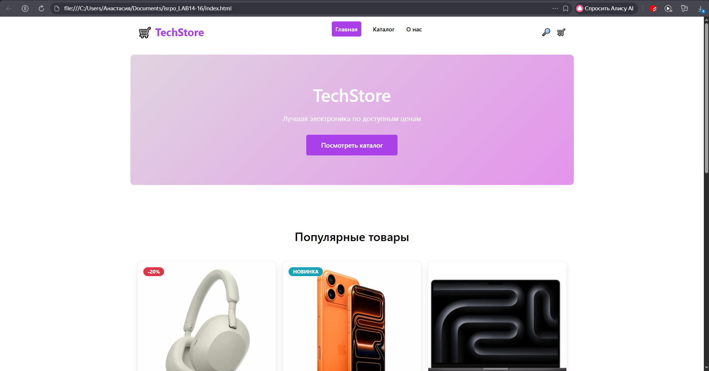
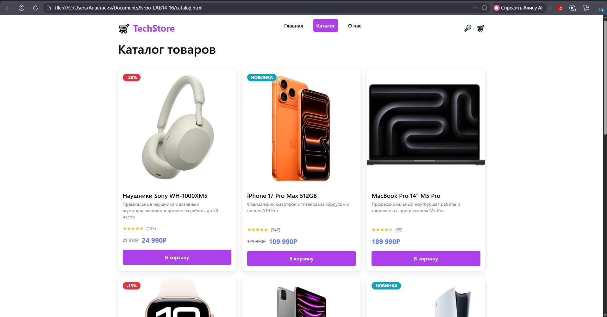
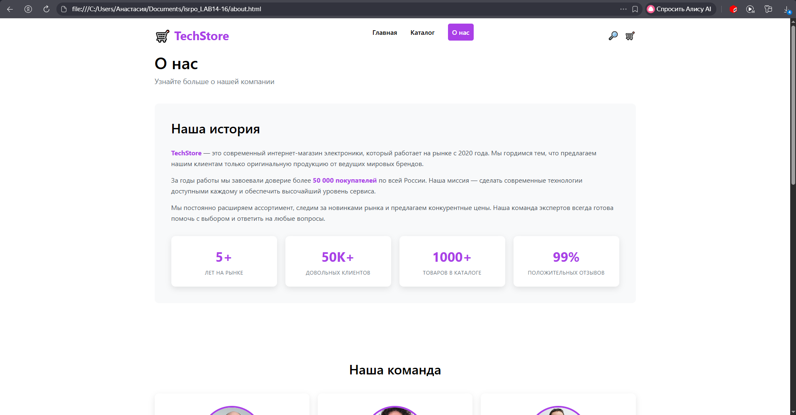
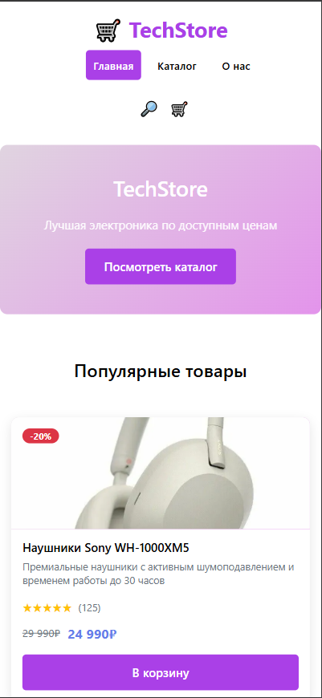
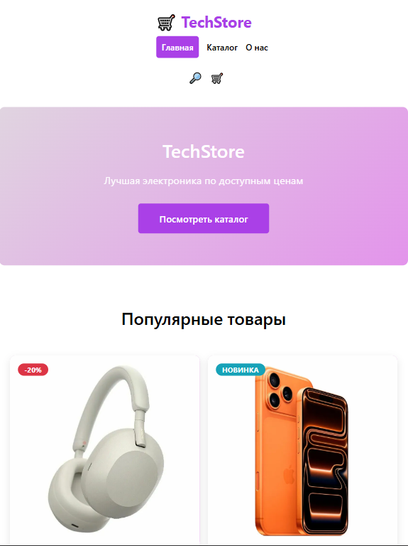

# Лабораторная работа №14-16 - Интернет-магазин "TechStore"

**ФИО:** Зламанюк Анастасия Александровна 
**Группа:** ИСП-231  
**Дата:** 28.02.2026

## *Описание проекта*

Многостраничный сайт интернет-магазина электроники "TechStore" с адаптивной вёрсткой.

## *Реализованные страницы*

- **Главная** — приветственный баннер, популярные товары, преимущества
- **Каталог** — сетка из 9 карточек товаров
- **О нас** — информация о магазине и команде

## *Реализованные функции*

- Адаптивное навигационное меню
- Карточки товаров с hover-эффектами
- CSS Grid для каталога (3 колонки)
- Flexbox для навигации и футера
- Адаптивная вёрстка (desktop/tablet/mobile)
- Единая цветовая схема и типографика
- Семантическая HTML5-разметка

## *Технологии*

- HTML5
- CSS3 (Flexbox, Grid, Media Queries)
- Git/GitHub

## *Скриншоты*
- Главная страница

- Каталог товаров

- О нас

- Мобильная версия

- Планшетная версия

